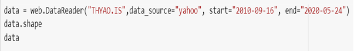
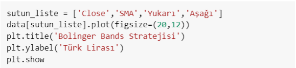
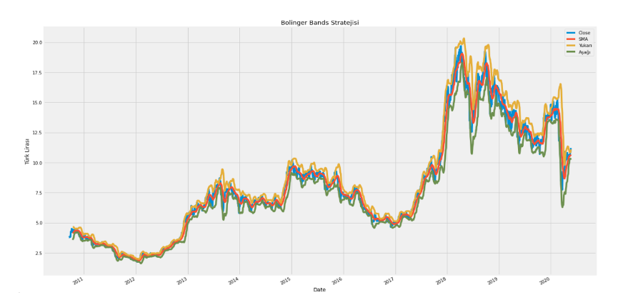
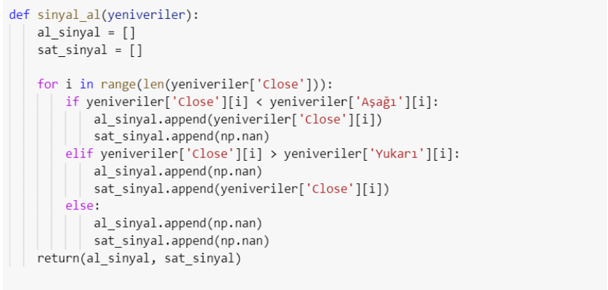
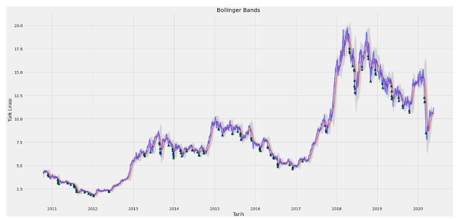

<h1>Dollar Rate Forecast</h1>

Recently, with the developing technology, transactions in financial markets have gained a different dimension. As a result of failures in financial markets, people gave more importance to technology. Thus, they aimed to minimize the errors and losses encountered. As a result, algorithms and analysis programs have emerged. As a result of the mentioned issues, an application study was carried out to calculate the buying and selling of stocks.

The codes in this study are written in Python. A syntax like simple and pseudocode; modularity; object-oriented design; It has profiling, portability, testing and self-documenting capabilities, libraries that provide massive amounts of digital information, computationally efficient storage and processing.
First, we need to call the libraries that are important to Python. Every library we import will help us run the code.
In this study, Numpy array and Panda library are used.

<h2>How Use Bollinger Band</h2>

Bollinger Band strategy will be created by using Turkish Airlines stocks. That's why we need to pull stocks over the web.

To briefly explain the codes, we first write how many daily data will be captured. Then, the most important feature of Bollinger Band is the simple moving average, we define it as SMA while defining it to the code.
Another important feature of Bollinger Band is standard deviation. For Standard deviation, we need to add the upper peak line and the lower boundary line.

In order to prevent the entered data from appearing scattered, it is provided to appear in order by adding a list method. Then, the data that is desired to appear on the graph is entered. The width, aspect ratios, title and coin type of the graphic are determined. When we run the code written for this, Bollinger Band chart is output.

After entering all the data, we start to write a trading strategy. To do this, we first need to create a function.

Latest version of Bollinger Band chart

